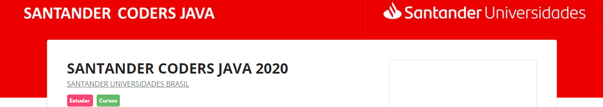
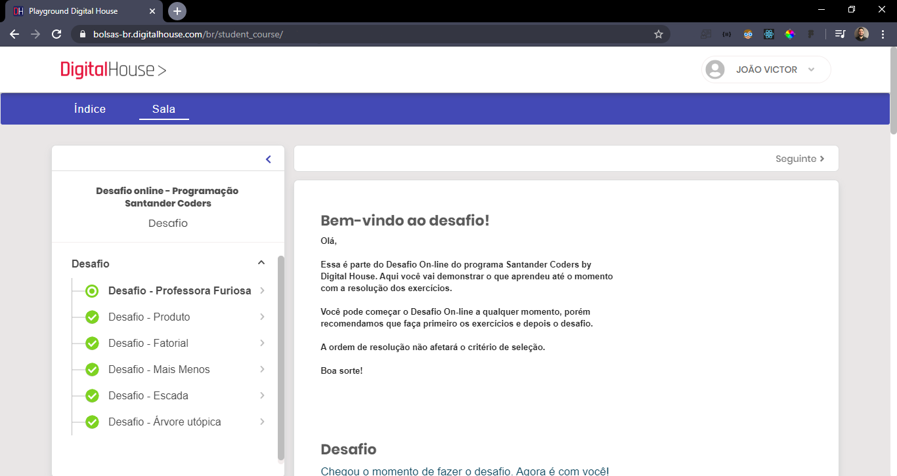

<h1 align="center">
  
</h1>

<h1 align="center">
  Santander_Coders_By_Digital_House - Curso Online (So far)
</h1>

## :computer: About
"Cursos (Online - Básico) de aperfeiçoamento de estudos em programação full Stack Java – Santander Coders by Digital House
(“Processo de Seleção”)". Para mais informações pode checar [aqui.](https://www.becas-santander.com/pt/program/santandercodersjava2020)

## Desafios Online - OK

